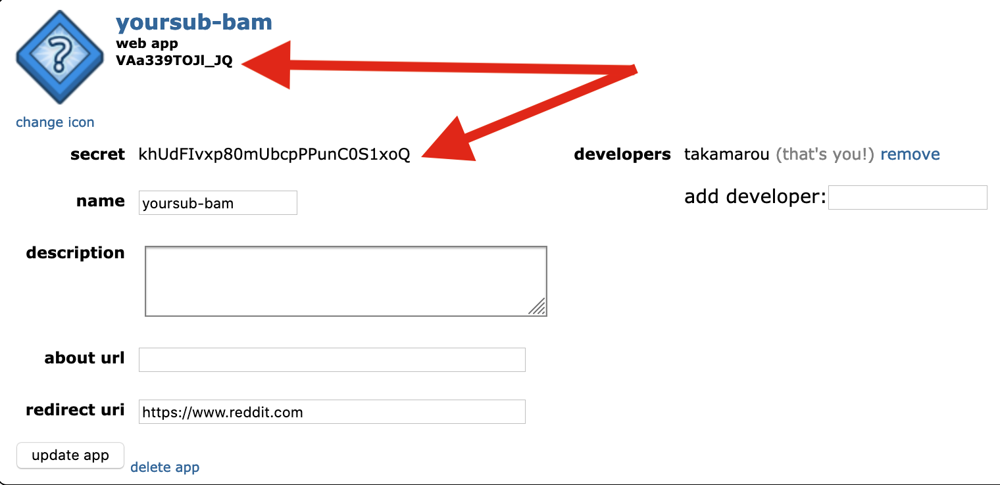

# Getting Started with BAM

## 1. Create a Reddit App

You need to create your own Reddit application for running BAM (each subreddit is separate, to avoid rate limiting issues). You can create an app by visiting your Reddit [application preferences page](https://www.reddit.com/prefs/apps). Scroll all the way to the bottom of that and click "create another app..."

Make sure you choose the `script` type. You can enter whatever you want for the redirect URL - it won't be used.

## 2. Make note of your keys

Once the app is created, make a note of your Client ID and Client Secret. You will need these in the next step.

## 3. Create a dedicated bot user

We **very strongly** recommend using a dedicated bot user for BAM, rather than running it with your personal account. It's much easier to tie a bot to a subreddit, so that it persists even with changes in staff, than to transfer accounts when people leave. It also makes it much clearer in Mod Log and Modmail whether it's a human or a bot taking action.

You will need to invite the bot to your subreddit as a moderator. At the very least the bot needs Wiki access (to read/write rules), but you'll also need to give the bot access to any of the moderator actions you expect it to perform. Common permissions include:

- Wiki **(required)**
- Posts
- Mail
- Access
- Flair

## 4. Create the Heroku app

You can host BAM anywhere, but Heroku is one of the easiest options. You can pretty much just click this button, and fill in all of the details:

## 5. Write some rules

Once the Heroku app is up and running, you will see two new files in your wiki: `better_auto_moderator` and `better_auto_moderator/rules`. The rules file is where you will write your rules - this should look and feel very much like your `automoderator/config` file. You can edit this file and write new rules - BAM will automatically pick up the changes and start moderating with them.

## 6. (OPTIONAL) Let BAM manage *all* of your rules

The recommended way to use BAM is to give it full control over all of your moderation rules, instead of having Automoderator configured entirely separately. By default BAM doesn't modify your AutoModerator settings, but if you want to centralize everything you should!

The biggest thing is you should make a backup of your `automoderator/config` file - BAM will overwrite this once it takes over, and you want to take care not to lose it. Once you have the backup, simply take your old AutoModerator rules and copy them into the `better_auto_moderator/rules` file.

Then open the `better_auto_moderator` file and change `overwrite_automoderator` to `true`. Save the file, and you're done!

You'll notice that your `automoderator/config` file was updated - BAM does this every time you write new rules. As much as possible BAM tries to let AutoModerator run rules itself, so it scans all of the rule definitions and pulls out the ones that fit within the defalt AutoModerator features. Those get automatically written to the `automoderator/config` file for you!

From now on, only ever make edits to the `better_auto_moderator` configuration files.
